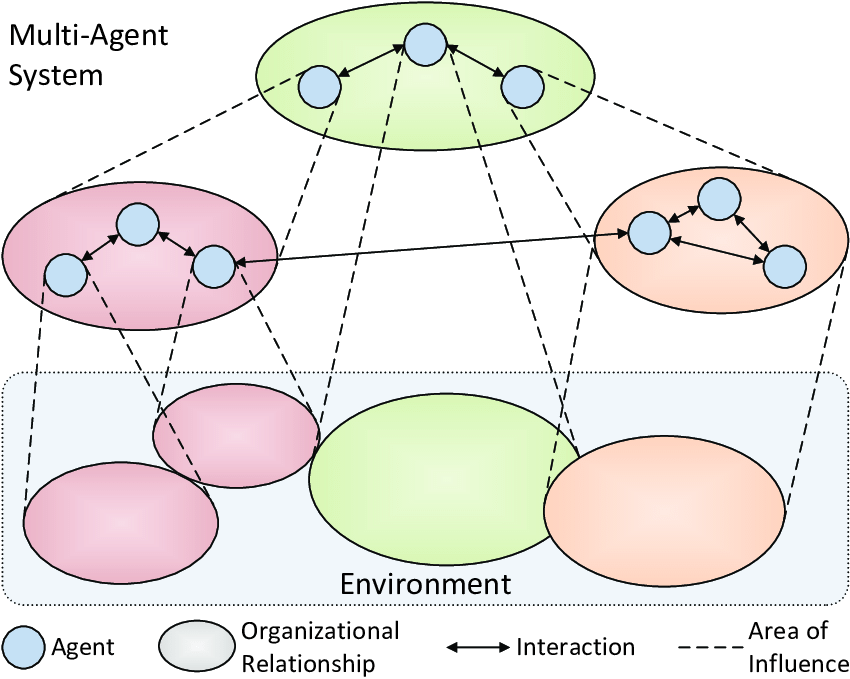
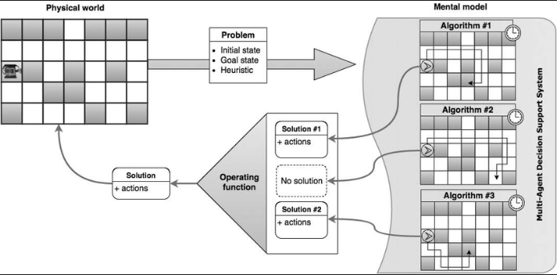

# Inteligent-Systems-Research

Pesquisa relacionada ao seminário da cadeira de Sistemas Inteligentes sobre Sistemas Multiagentes.

## O que é?

Sistemas Multiagentes (SMA) são sistemas computacionais compostos de dois ou mais agentes inteligentes que interagem entre si, sendo capazes de perceber e agir em seus respectivos ambientes. São utilidos para resolução de problemas complexos que requerem a coordenação entre multiplos agentes ou componentes. 

Ilustração de Sistemas Multiagentes

  

## Como surgiu e em que contexto histórico?

História da Inteligência Artificial

  

O surgimento de Sistemas Multiagentes aconteceu nas décadas de 1980 e 1990, após o primeiro inverno da IA e juntamente ao crescimento nas pesquisas dos Sistemas Especialistas. 

Vale destacar também os avanços do desenvolvimento do Hardware da época e o surgimento da internet ([ARPANET](https://en.wikipedia.org/wiki/ARPANET)) iniciaram-se as pesquisas na área de computação distribuida

ARPANET

  

Os principais trabalhos da época tinham como motivação superar as limitações dos modelos tradicionais centralizados de inteligência artificial, onde um único agente era responsável pela tomadas de decisão e ações. Dentre os trabalhos acadêmicos na área de Sistemas Multiagentes, podem-se destacar:

* "[Distributed Artificial Intelligence](https://www.google.com.br/books/edition/_/83I-AQAAIAAJ?hl=pt-BR&sa=X&ved=2ahUKEwiRzsfJ44j9AhUNqJUCHff4DRkQre8FegQIFRAG)" edited by L. Gasser and M. Huhns, 1988.
* "[Communication and Interaction in Multi-Agent Planning](https://www.sciencedirect.com/science/article/pii/B978093461363750022X)" by M. Georgeff, 1988.
* "[A Theoretical Framework for Computer Models of Cooperative Dialogue, Acknowledging Multi-Agent Conflict](https://www.proquest.com/openview/8951db6fd315ae2483d8a86b765f4066/1?pq-origsite=gscholar&cbl=18750&diss=y)" by J. R. Galliers.

## Para que serve? 

Um sistema multiagente, assim como um agente inteligente, é uma entidade autônoma capaz de perceber seu ambiente, tomar decisões e agir de acordo com essas decisões para atingir um objetivo, que muitas vezes é uma solução possível para um problema modelado.  

Agente Inteligente

  

## Por que existe?

Um cenário histórico propício, com o surgimento da internet, melhorias das capacidades de hardware e uma segunda primavera da inteligência artificial, permitiram a pesquisadores experimentar novas técnicas para resolver problemas complexos e uma delas foi a combinação de agentes inteligentes, criando um sistema multi-agentes.

## Quando é usado?

Sistemas multiagentes são particularmente úteis para resolução de problemas onde os agentes tem objetivos conflitantes, onde a coordenação e a comunicação são necessárias para chegar a uma solução. 

## Como funciona? 

Por um único agente inteligente possui limitações para solucionar um problema complexo, a solução de um Sistema Multiagentes é dividir o problema em subproblemas menores que possam ser resolvidos pelos agentes inteligentes, criando uma arquitetura com vários agentes inteligente. Também é necessário adicionar interações entre cada um desses agentes, sendo a troca de informações entre eles um parametro importante para tomada de decisões, além das observações do ambiente perceptível por eles. A coordenação e comunicação entre esses agentes é atingida através do uso de protocolos, linguagens e algoritmos para comunicação, negociação e tomadas de decisão.

Sistema com dois agentes

  

## Exemplos de uso

Sistemas Distribuídos

  

Sistemas Multiagente podem ser utilizados para construir Sistemas Distribuídos de 
larga escala, onde as tarefas do sistema são distribuidas entre os vários agentes.

Sistemas Autônomos

  

Sistemas Multiagente podem ser utilizados na construção de Sistemas Autônomos, que podem operar e tomar decisões de maneira independente.

Resolução de Problemas Complexos

  

Sistemas Multiagente podem ser utilizados para resolver problemas que estão além da capacidade de uma única unidade computacional ou algoritmo, decompondo o problema maior em vários problemas menores que podem ser solucionados por multiplos agentes.

Ambientes Dinâmicos e Imprevisíveis

  

Sistemas Multiagente podem ser utilizados em ambientes que as condições mudam de maneira muito abrupta, permitindo o desenvolvimento se sistemas adaptáveis.

Simulação e Modelagem

  

Sistemas Multiagentes podem ser utilizados para desenvolvimento de simulações e modelagem de comportamentos, pois permite que cada um dos seus agentes assuma um comportamento específico parecido com aquilo que se deseja simular/modelar.

Robôtica

  

Sistemas Multiagente podem ser utilizados na robôtica, permitindo a criação de sistemas que incorporem multiplos robôs para atingir um objetivo em comum.

## Quais são as aplicações práticas possíveis?

Alguns exemplos à baixo:

Plataformas de Nuvem

  

AWS (Amazon Web Services), Microsoft Azure e o GCP (Google Cloud Platform) utilizam Sistemas Multiagente para gerenciar sua enorme e distribuida infraestrutura. Os agentes desse sistema são responsáveis por coordenar a alocação de recursos e garantir que diferentes partes do sistema funciona de maneira correta.

Waze

  

O Waze utiliza Sistemas Multiagentes para gerenciar a sua navegação de GPS. Os agentes do Waze coletam e processam em tempo real os dados de tráfego dos usuários para gerar a situação de trânsito em tempo real.

Assistentes por voz

  

Siri, Alexa e Google Assistant utilizam Sistemas Multiagente para processar comandos por voz, gerar respostas e coordenar com outras partes dos sistema para poder prover informação e realizar tarefas.

Carros Autônomos

  

A Tesla utiliza Sistemas Multiagente no seu produto do Autopilot para gerenciar o seu sistema de direção autônoma. Os agentes são responsáveis por processar os dados recebidos pelos sensores e tomar decisões sobre o curso do veículo. 

## Que ferramentas existem disponíveis que facilitam sua implementação?

Alguns exemplos à baixo:

FIPA

  

Foundation for Intelligent Physical Systems, uma sociedade fundada pelo IEEE, delimitou os padrões que são utilizados pelas tecnológias baseadas em agentes inteligentes e os padrões de comunicação entre esses agentes com outras tecnologias.

OMG

  

Object Management Group é um consórcio que define padrões da indústria de computação. Dentre esses padrões estão os de softwares baseados em agentes inteligentes e sua interoperabilidade.

JADE

  

Java Agent DEvelopment Framework é uma plataforma open-source para aplicações peer-to-peer baseada em agentes inteligentes.

NetLogo

  

NetLOGO é uma linguagem de programação visual para implementar Sistemas Multiagente. Provê uma plataforma para desenvolver e testar agentes, e suporta simulação e modelagem dos mesmos.

